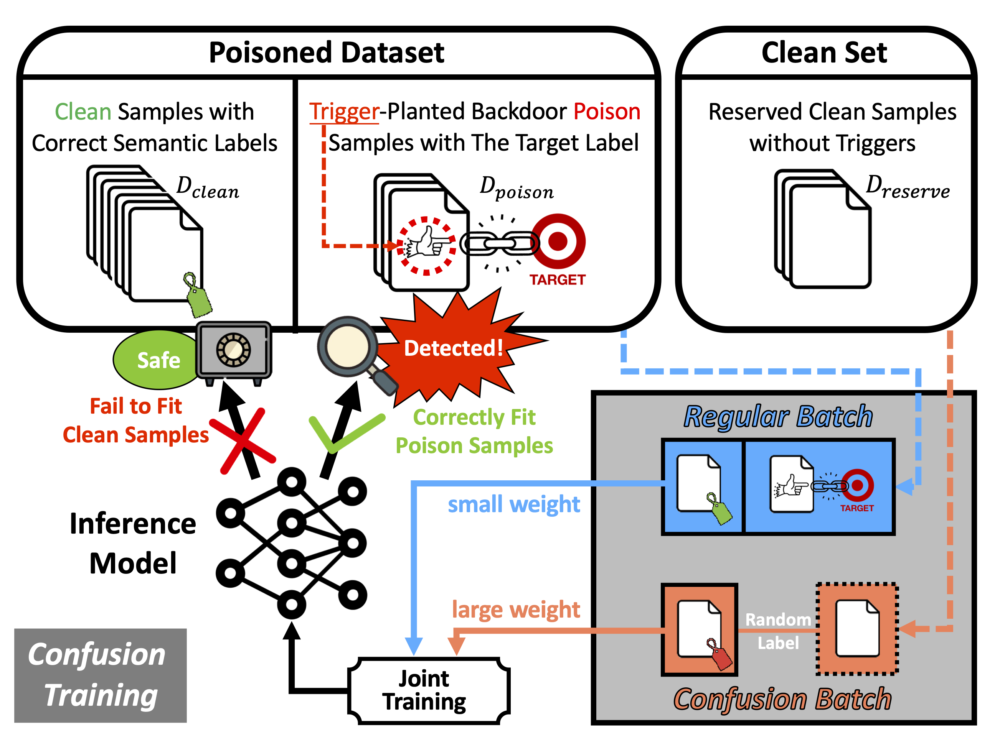

<h1 align='center' style="text-align:center; font-weight:bold; font-size:2.0em;letter-spacing:2.0px;"> Towards A Proactive ML Approach for Detecting Backdoor Poison Samples </h1>
<p align='center' style="text-align:center;font-size:1.25em;">
    <a href="https://github.com/Unispac/Fight-Poison-With-Poison" target="_blank" style="text-decoration: none;">Xiangyu Qi</a>&nbsp;,&nbsp;
    <a href="https://github.com/Unispac/Fight-Poison-With-Poison" target="_blank" style="text-decoration: none;">Tinghao Xie</a>&nbsp;,&nbsp;
    <a href="https://github.com/Unispac/Fight-Poison-With-Poison" target="_blank" style="text-decoration: none;">Jiachen T. Wang</a>&nbsp;,&nbsp;
    <a href="https://github.com/Unispac/Fight-Poison-With-Poison" target="_blank" style="text-decoration: none;">Tong Wu</a>
    <a href="https://github.com/Unispac/Fight-Poison-With-Poison" target="_blank" style="text-decoration: none;">Saeed Mahloujifar</a><br/>&nbsp;,&nbsp;
    <a href="https://github.com/Unispac/Fight-Poison-With-Poison" target="_blank" style="text-decoration: none;">Prateek Mittal</a>&nbsp;&nbsp; 
    <br/> 
Princeton University<br/> 
</p>

<p align='center';>
<b>
<em>USENIX Security 2023</em> <br>
</b>
</p>

<p align='center' style="text-align:center;font-size:2.5 em;">
<b>
    <a href="https://arxiv.org/abs/2205.13616" target="_blank" style="text-decoration: none;">arXiv</a>&nbsp;
</b>
</p>
----------------------------------------------------------------------


Official repostory for (USENIX 2023) [Towards A Proactive ML Approach for Detecting Backdoor Poison Samples](https://arxiv.org/abs/2205.13616).



Adversaries can embed backdoors in deep learning models by introducing backdoor poison samples into training datasets. In this work, we investigate how to detect such poison samples to mitigate the threat of backdoor attacks. 
1. First, we uncover a **post-hoc workflow** underlying most prior work, where defenders **passively** allow the attack to proceed and then leverage the characteristics of the post-attacked model to uncover poison samples. We reveal that this workflow does not fully exploit defenders’ capabilities, and defense pipelines built on it are **prone to failure or performance degradation** in many scenarios.
2. Second, we suggest a paradigm shift by promoting a **proactive mindset** in which defenders engage proactively with the entire model training and poison detection pipeline, directly enforcing and magnifying distinctive characteristics of the post-attacked model to facilitate poison detection. Based on this, we formulate a unified framework and provide practical insights on designing detection pipelines that are more robust and generalizable. 
3. Third, we introduce the technique of **Confusion Training (CT)** as a concrete instantiation of our framework. CT applies an additional poisoning attack to the already poisoned dataset, actively **decoupling benign correlation while exposing backdoor patterns to detection**. Empirical evaluations on 4 datasets and 14 types of attacks validate the superiority of CT over 14 baseline defenses.

---

> This is a brief introduction to get you start with our code. Refer to [misc/reproduce.md](misc/reproduce.md) for more details to reproduce our major results.


## Hardware

Our artifact is compatible with common hardware settings, only specifically requiring NVIDIA GPU support. We recommend a computing node equipped with Intel CPU (≥32 cores) and ≥2 Nvidia A100 GPUs.


## Dependency

Our experiments are conducted with PyTorch 1.12.1, and should be compatible with PyTorch of newer versions. To reproduce our defense, first manually install PyTorch with CUDA, and then install other packages via `pip install -r requirement.txt`.


## TODO before You Start

- Original CIFAR10 and GTSRB datasets would be automatically downloaded. <font color=red>But Ember and ImageNet must be manually downloaded and set ... </font>
- Before any experiments, first initialize the clean reserved data and validation data using command `python create_clean_set.py -dataset=$DATASET -clean_budget $N`, where `$DATASET = cifar10, gtsrb, ember, imagenet`, `$N = 2000` for `cifar10, gtsrb`, `$N = 5000` for `ember, imagenet`.
- Before launching `clean_label` attack, run [data/cifar10/clean_label/setup.sh](data/cifar10/clean_label/setup.sh).
- Before launching `dynamic` attack, download pretrained generators `all2one_cifar10_ckpt.pth.tar` and `all2one_gtsrb_ckpt.pth.tar` to [models/](models/) from https://drive.google.com/file/d/1vG44QYPkJjlOvPs7GpCL2MU8iJfOi0ei/view?usp=sharing and https://drive.google.com/file/d/1x01TDPwvSyMlCMDFd8nG05bHeh1jlSyx/view?usp=sharing.
- `SPECTRE` baseline defense is implemented in Julia. To compare our defense with `SPECTRE`, you must install Julia and install dependencies before running SPECTRE, see [other_cleansers/spectre/README.md](other_cleansers/spectre/README.md) for configuration details.
- `Frequency` baseline defense is based on Tensorflow. If you would like to reproduce their results, please install Tensorflow (code is tested with Tensorflow 2.8.1 and should be compatible with newer versions) manually, after installing all the dependencies upon.


## A Gentle Start

To help readers get to know the overall pipeline of our artifact, we first illustrate an example by showing how to launch and defend against BadNet attack on CIFAR10 (corresponding to BadNet lines in Table 1 and Table 2 of the paper).

> All our scripts adopt command-line options using `argparse`. 

### **Step 1**: Create a poisoned training set.
```bash
python create_poisoned_set.py -dataset=cifar10 -poison_type=badnet -poison_rate=0.003
```

### **Step 2**: Train a backdoored model on this poisoned training set.
```bash
python train_on_poisoned_set.py -dataset=cifar10 -poison_type=badnet -poison_rate=0.003
```
The model checkpoint will be automatically saved to [poisoned_train_set/cifar10/badnet_0.003_poison_seed=0/full_base_aug_seed=2333.pt](poisoned_train_set/cifar10/badnet_0.003_poison_seed=0/full_base_aug_seed=2333.pt).

After training, you may evaluate the trained model's performance (ACC & ASR) via:
```bash
python test_model.py -dataset=cifar10 -poison_type=badnet -poison_rate=0.003
```

You may also visualize the latent space of the backdoor model (like Fig 2) w.r.t. clean and poison samples via:

```bash
python visualize.py -method=tsne -dataset=cifar10 -poison_type=badnet -poison_rate=0.003
```

### **Step 3**: Defend against the BadNet attack.

To launch our **confusion training** defense, run script:
```bash
# Cleanse the poisoned training set (results in Table 1)
python ct_cleanser.py -dataset=cifar10 -poison_type=badnet -poison_rate=0.003 -devices=0,1 -debug_info

# Retrain a benign model on the cleansed training set (results in Table 2)
python train_on_cleansed_set.py -cleanser=CT -dataset=cifar10 -poison_type=badnet -poison_rate=0.003
```

To launch baseline defenses (poison set cleanser), run script:
```bash
# Cleanse the poisoned training set (results in Table 1)
python other_cleanser.py -cleanser=$CLEANSER -dataset=cifar10 -poison_type=badnet -poison_rate=0.003 # $CLEANSER = ['SCAn', 'AC', 'SS', 'Strip', 'SPECTRE', 'SentiNet', 'Frequency']

# Retrain a benign model on the cleansed training set (results in Table 2)
python train_on_cleansed_set.py -cleanser=$CLEANSER -dataset=cifar10 -poison_type=badnet -poison_rate=0.003
```

And to launch other baseline defenses (not poison set cleanser), run script:
```bash
# (results in Table 2)
python other_defense.py -defense=$DEFENSE -dataset=cifar10 -poison_type=badnet -poison_rate=0.003 # $DEFENSE = ['ABL', 'NC', 'NAD', 'FP']
```


